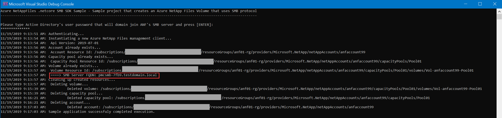

# Azure NetAppFiles SDK SMB Sample .NETCore

This project demonstrates how to use dotnet-core with NetApp Files SDK for Microsoft.NetApp resource provider to deploy a SMB Volume.

In this sample application we perform the following operations:

* Creation
  * NetApp Files Account
  * Capacity Pool
  * SMB enabled Volume
* Clean up created resources

>Note: the clean up execution is disable by default, if you want to run this end to end with the clean up, please change variable `cleanup` from `false` to `true` at program.cs.

If you don't already have a Microsoft Azure subscription, you can get a FREE trial account [here](http://go.microsoft.com/fwlink/?LinkId=330212).

## Prerequisites

1. Azure Subscription
1. Subscription needs to be whitelisted for Azure NetApp Files. For more information, please refer to [this](https://docs.microsoft.com/azure/azure-netapp-files/azure-netapp-files-register#waitlist) document.
1. Resource Group created
1. Virtual Network with a delegated subnet to Microsoft.Netapp/volumes resource. For more information, please refer to [Guidelines for Azure NetApp Files network planning](https://docs.microsoft.com/en-us/azure/azure-netapp-files/azure-netapp-files-network-topologies)
1. For this sample console appplication work, we are using service principal based  authenticate, follow these steps in order to setup authentication:
    1. Within an [Azure Cloud Shell](https://docs.microsoft.com/en-us/azure/cloud-shell/quickstart) session, make sure you're logged on at the subscription where you want to be associated with the service principal by default:
        ```bash
        az account show
        ```
        If this is not the correct subscription, use             
          ```bash
         az account set -s <subscription name or id>  
         ```
    1. Create a service principal using Azure CLI
        ```bash
        az ad sp create-for-rbac --sdk-auth
        ```

        >Note: this command will automatically assign RBAC contributor role to the service principal at subscription level, you can narrow down the scope to the specific resource group where your tests will create the resources.

    1. Copy the output content and paste it in a file called azureauth.json and secure it with file system permissions
    1. Set an environment variable pointing to the file path you just created, here is an example with Powershell and bash:
        Powershell 
        ```powershell
       [Environment]::SetEnvironmentVariable("AZURE_AUTH_LOCATION", "C:\sdksample\azureauth.json", "User")
       ```
        Bash
        ```bash
        export AZURE_AUTH_LOCATION=/sdksamples/azureauth.json
        ``` 

        >Note: for more information on service principal authentication with dotnet, please refer to [Authenticate with the Azure Libraries for .NET](https://docs.microsoft.com/en-us/dotnet/azure/dotnet-sdk-azure-authenticate?view=azure-dotnet)
1. Active Directory infrastructure setup with one or more DNS servers from the AD domain (usually the Domain Controllers) available in the **same virtual network** where you're setting up Azure NetApp Files. If you want to setup an Active Directory test environment, please refer to [Create a new Windows VM and create a new AD Forest, Domain and DC](https://github.com/Azure/azure-quickstart-templates/tree/master/active-directory-new-domain#create-a-new-windows-vm-and-create-a-new-ad-forest-domain-and-dc) for a quick setup, then you can work on the vnet that gets created to setup the subnet requirements for ANF.

# What is anf-dotnetcore-smb-sdk-sample.dll doing? 

This sample project is dedicated to demonstrate how to deploy a Volume in Azure NetApp Files that uses SMB protocol, similar to other ANF SDK examples, the authentication method is based on a service principal, this project then will ask for the Active Directory user password and after validating that it is not null, it will create a single volume with a single capacity pool using standard service level tier and finally the SMB Volume, the resources clean up process after the sample application execution is disabled by default, if you want to perform the removal right after the creation operations, please change variable `cleanup` from `false` to `true` at **program.cs** file. For a more advanced example, for example usage of async methods (with NFS v3 and v4.1 volumes), please see the first item in the references section of this document.

SMB Volumes will require that you have an Active Directory domain available for you to use, with the DNS Servers you will define (as comma separated string) within the same virtual network (any subnet with exception of ANF Volume's delagated subnet) where your ANF service will use to setup its volumes. The username provided must be a user that has rights to domain join computers and although we setup Active Directory at NetApp Account level, the SMB server will be created only when the volume gets deployed. Finally, you will notice that the SMB server created in AD will be appended with the SMB Server prefix you configured plus a sequence of random characters, up to 15 in total name length. This application will output the final SMB server FQDN as highlighted in the [screenshot](#SampleOutput).

# How the project is structured

The following table describes all files within this solution:

| Folder      | FileName                | Description                                                                                                                         |
|-------------|-------------------------|-------------------------------------------------------------------------------------------------------------------------------------|
| Root        | program.cs              | Authenticates and executes all operations                                                                                           |
| Root\Common | CommonSdk.cs            | Static class dedicated to common operations related to ANF's SDK, in this example, it exposes GetResourceAsync and WaitForNoAnfResource methods  |
| Root\Common | ResourceUriUtils.cs     | Static class that exposes some methods that helps parsing Uris, building a new Uris or getting a resource name from Uri for example |
| Root\Common | ServicePrincipalAuth.cs | Small static class used when working with Service Principal based authentication                                                    |
| Root\Common | Utils.cs                | Static class that exposes a few methods that helps on various tasks, like writting a log to the console for example.                |
| Root\Models | AzureAuthInfo.cs        | Class that defines an Azure AD Service Principal authentication file                                                                |

# How to run the console application

1. Clone it locally
    ```powershell
    git clone https://github.com/Azure-Samples/netappfiles-dotnetcore-smb-sdk-sample.git
    ```
1. Make sure you change the variables located at **.netappfiles-dotnetcore-smb-sdk-sample\src\anf-dotnetcore-smb-sdk-sample\program.cs in RunAsync method.**
1. Change folder to **.netappfiles-dotnetcore-smb-sdk-sample\src\anf-dotnetcore-smb-sdk-sample**
1. Since we're using service principal authentication flow, make sure you have the **azureauth.json** and its environment variable with the path to it defined (as previously described)
1. Build the console application
    ```powershell
    dotnet build
    ```
1. Run the console application
    ```powershell
    dotnet run
    ```

Sample output<a name="SampleOutput"></a>


# References

* [Azure NetAppFiles SDK Sample for .NETCore - More advanced example](https://docs.microsoft.com/en-us/samples/azure-samples/netappfiles-dotnetcore-sdk-sample/azure-netappfiles-sdk-sample-for-netcore/)
* [Authenticate with the Azure Libraries for .NET](https://docs.microsoft.com/en-us/dotnet/azure/dotnet-sdk-azure-authenticate?view=azure-dotnet)
* [Resource limits for Azure NetApp Files](https://docs.microsoft.com/en-us/azure/azure-netapp-files/azure-netapp-files-resource-limits)
* [Azure Cloud Shell](https://docs.microsoft.com/en-us/azure/cloud-shell/quickstart)
* [Azure NetApp Files documentation](https://docs.microsoft.com/en-us/azure/azure-netapp-files/)
* [Download Azure SDKs](https://azure.microsoft.com/downloads/)

